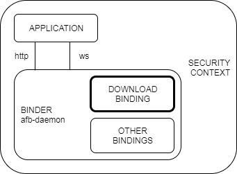
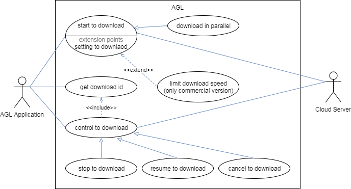
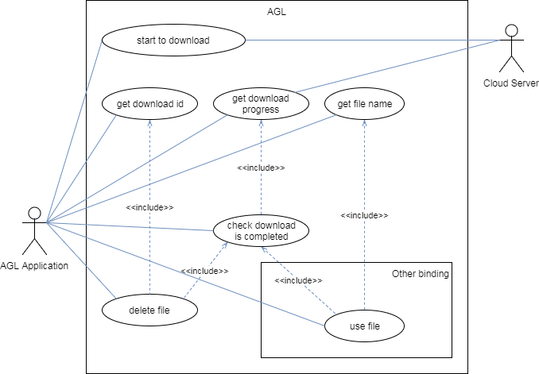
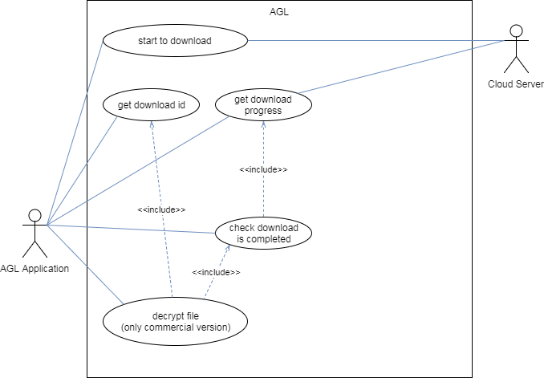

[afb-bindings-writing]: https://gerrit.automotivelinux.org/gerrit/gitweb?p=src/app-framework-binder.git;a=blob;f=doc/afb-bindings-writing.md;h=6327734efab9019e047c7999003a9abbb2eeae6f;hb=refs/heads/chinook
[afb-application-writing]: https://gerrit.automotivelinux.org/gerrit/gitweb?p=src/app-framework-binder.git;a=blob;f=doc/afb-application-writing.md;h=14199f62c5f0778c128d67595b117032e3a7291d;hb=refs/heads/chinook

# Contents

- [1. Introduction](#1-introduction)
- [2. Product Summary](#2-product-summary)
    - [2.1. Overview](#21-overview)
    - [2.2. Feature](#22-feature)
- [3. Use Cases](#3-use-cases)
    - [3-1. Download](#31-download)
    - [3-2. Use the downloaded file](#32-use-the-downloaded-file)
    - [3-3. Decrypt the downloaded file](#33-decrypt-the-downloaded-file)
- [4. API Specification](#4-api-specification)
    - [4.1. Overview](#41-overview)
    - [4.2. Download API](#42-download-api)
        - [download/setting](#downloadsetting)
        - [download/download](#downloaddownload)
        - [download/info](#downloadinfo)
        - [download/stop](#downloadstop)
        - [download/resume](#downloadresume)
        - [download/cancel](#downloadcancel)
        - [download/delete](#downloaddelete)

# 1. Introduction

This document provides the following details of download binding:

- [Product Summary](#2-product-summary)
- [Use Cases](#3-use-cases)
- [API Specification](#4-api-specification)


# 2. Product Summary

## 2.1. Overview

This is a binding for a binder included in AGL.(*1)



This binding is dynamically loaded libraries in the binder process.

This binding provides an API to download files.

*1) http://docs.automotivelinux.org/docs/apis_services/en/dev/reference/af-binder/afb-overview.html


## 2.2. Feature

This binding:
- downloads files in parallel.
- controlls to start, stop, resume or cancel donwload.
- deletes a downloaded file.
- gets a download progress.
- supports SSL.

(The following functions supported only in commercial version.)
- limits download speed.
- decrypts a downloaded file.


# 3. Use Cases

This section shows several use cases using this binding.

## 3.1. Download

This is the basic use case to download.
The AGL application can:
- download files from the cloud server.
- download files in parallel.
- controll(stop, resume or cancel) to download.

Optionally:
- a download speed is able to limit.



| Use Case              | How to implement the use case for the Application                                             |
|-----------------------|-----------------------------------------------------------------------------------------------|
| start to download     | call [download/download](#downloaddownload)                                                   |
| download in parallel  | call [download/download](#downloaddownload) during other download                             |
| limit download speed  | call [download/download](#downloaddownload) with the option parameter                         |
| get download id       | call [download/info](#downloadinfo)                                                           |
| control to download   | call [download/stop](#downloadstop) or [resume](#downloadresume) or [cancel](#downloadcancel) |
| stop to download      | call [download/stop](#downloadstop)                                                           |
| resume to download    | call [download/resume](#downloadresume)                                                       |
| cancel to download    | call [download/cancel](#downloadcancel)                                                       |


## 3.2. Use the downloaded file

If The AGL application would like to use the downloaded file, it can use the file using other bindings.

If the used file is unnecessary, it can be deleated.

ex) The AGL application downloads an AGL application(.wgt), and installs it in the AGL using the binding that installs a widget file.



| Use Case                    | How to implement the use case for the Application |
|-----------------------------|---------------------------------------------------|
| get download progress       | call [download/info](#downloadinfo)               |
| check download is completed | check the download progress is 100%               |
| get file name               | call [download/info](#downloadinfo)               |
| delete file                 | call [download/delete](#downloaddelete)           |
| use file                    | call other API with the file name as a parameter  |


## 3.3. Decrypt the downloaded file

The AGL application can decrypt the downloaded encrypted file.

However, it is a precondition that the public key is exchanged with the cloud server in advance.



| Use Case                    | How to implement the use case for the Application |
|-----------------------------|---------------------------------------------------|
| decrypt file                | call download/decrypt                             |


# 4. API Specification

## 4.1. Overview

This binding provides an API with the following name:

- API name : download

and contains the following verbs:

- Verbs

| Verb name                         | Description                                                    |
|-----------------------------------|----------------------------------------------------------------|
| [setting](#downloadsetting)       | set download options                                           |
| [download](#downloaddownload)     | download a file                                                |
| [info](#downloadinfo)             | get download information                                       |
| [stop](#downloadstop)             | stop to download                                               |
| [resume](#downloadresume)         | resume to download                                             |
| [cancel](#downloadcancel)         | cancel to download                                             |
| [delete](#downloaddelete)         | delete the downloaded file                                     |
| decrypt                           | decrypt the downloaded encrypted file                          |


## 4.2. Download API

These are the download API Verbs specification.

The following is a description of each item:

- Resource URL

  This is URL for calling the verb.

- Session Constant

  This is ["authorisation and session requirements of the method"][afb-bindings-writing].

- Parameters

  These are parameters with calling the verb.

- Responses

    - Sucsess

      This is a response that will be returned when the verb succeeds.
      This is the response object included in the [afb-reply][afb-application-writing],
      when request.status is "sucsess".

    - Failure

      This is a response that will be returned when the verb fails.
      This is the request.info message included in the [afb-reply][afb-application-writing],
      when request.status is "failed".

- Example Request

  This is a request example.

- Example Response

  This is a response example.


---


### download/setting

Set or Get default values of download options.

#### *Resource URL*

http://$BOARDIP:$PORT/api/download/setting

#### *Session Constant*

AFB_SESSION_CHECK

#### *Parameters*

If you set no parameter, you only get default values.

| Name        | Required | Type     | Description                            | Default Value |
|-------------|----------|----------|----------------------------------------|---------------|
| max_speed   | optional | number   | max download speed (bytes per second)  | 0(unlimited)  |

| Name        | Validation                                 |
|-------------|--------------------------------------------|
| max_speed   | range: 0(unlimited) - 104857600(100Mbps)   |

#### *Responses*

- Sucsess

The response includes default values of download options.

| Name        | Type     | Description                            |
|-------------|----------|----------------------------------------|
| max_speed   | number   | max download speed (bytes per second)  |

- Failure

| Message                          |
|----------------------------------|
| max_speed is invalid value       |


#### *Example Request*

```
BOARDIP="192.168.x.x"
PORT=1234
UUID="850c4594-1be1-4e9b-9fcc-38cc3e6ff015"
TOKEN="0aef6841-2ddd-436d-b961-ae78da3b5c5f"
curl http://$BOARDIP:$PORT/api/download/setting?uuid=$UUID\&token=$TOKEN\&max_speed=104857600
```

#### *Example Response*

```
{
  "response": {
    "max_speed": 104857600
  },
  "jtype": "afb-reply",
  "request": {
    "status": "success"
  }
}
```
```
{
  "jtype": "afb-reply",
  "request": {
     "status": "failed",
     "info": "max_speed is invalid value"
  }
}
```


---


### download/download

Download a file from the cloud server.

#### *Resource URL*

http://$BOARDIP:$PORT/api/download/download

#### *Session Constant*

AFB_SESSION_CHECK

#### *Parameters*

| Name        | Required | Type     | Description                            | Default Value |
|-------------|----------|----------|----------------------------------------|---------------|
| url         | required | string   | file's URL                             | none          |
| filename    | required | string   | output file name                       | none          |
| max_speed   | optional | number   | max download speed (bytes per second)  | 0(unlimited)  |

| Name        | Validation                                 |
|-------------|--------------------------------------------|
| url         | maximum length: 2083                       |
| filename    | maximum length: 255                        |
| max_speed   | range: 0(unlimited) - 104857600(100Mbps)   |

#### *Responses*

- Sucsess

| Name        | Type     | Description                            |
|-------------|----------|----------------------------------------|
| id          | number   | the ID of the download                 |

- Failure

| Message                          |
|----------------------------------|
| url is invalid value             |
| filename is invalid value        |
| filename already exists          |
| max_speed is invalid value       |


#### *Example Request*

```
BOARDIP="192.168.x.x"
PORT=1234
UUID="850c4594-1be1-4e9b-9fcc-38cc3e6ff015"
TOKEN="0aef6841-2ddd-436d-b961-ae78da3b5c5f"
curl http://$BOARDIP:$PORT/api/download/download?uuid=$UUID\&token=$TOKEN\&url="http://www.xxxxxx.co.jp/file"\&filename="sample"
```

#### *Example Response*

```
{
  "response": {
    "id": 507
  },
  "jtype": "afb-reply",
  "request": {
    "status": "success"
  }
}
```


---


### download/info

Get the download information or all download information list.

#### *Resource URL*

http://$BOARDIP:$PORT/api/download/info

#### *Session Constant*

AFB_SESSION_CHECK

#### *Parameters*

When you set no parameter, you get all download information list.

| Name        | Required | Type     | Description                            | Default Value |
|-------------|----------|----------|----------------------------------------|---------------|
| id          | optional | number   | the ID of the download                 | none          |

| Name        | Validation                                 |
|-------------|--------------------------------------------|
| id          | range: 0 - 999                             |

#### *Responses*

- Sucsess

The response includes the download information.

When the id is specified:

| Name        | Type     | Description                                  |
|-------------|----------|----------------------------------------------|
| downloading | object   | the download information                     |

When you set no parameter:

| Name         | Type                                    | Description                                  |
|--------------|-----------------------------------------|----------------------------------------------|
| downloadings | array (contains the downloading object) | all download information list                |

- Failure

| Message                          |
|----------------------------------|
| max_speed is invalid value       |

##### object definitions

- downloading

| Name        | Type     | Description                                                                          |
|-------------|----------|--------------------------------------------------------------------------------------|
| id          | number   | the ID of the download                                                               |
| url         | string   | file's URL                                                                           |
| filename    | string   | output file name                                                                     |
| max_speed   | number   | max download speed (bytes per second)                                                |
| state       | number   | state of download (0:pause 1:running 2:done 3:error(*1))                             |
| progress    | number   | progress of download (%)                                                             |
| error_type  | string   | set error type when state becomes 3:error. Details are [here](#error-information).   |
| error_code  | number   | set error code when state becomes 3:error. Details are [here](#error-information).   |

*1) When the error occured, please call [download/delete](#downloaddelete) if you want to delete the download information.

###### error information

| error_type  | error_code                                                                        | Description                            |
|-------------|-----------------------------------------------------------------------------------|----------------------------------------|
| curl        | see [CURLcode error code](https://curl.haxx.se/libcurl/c/libcurl-errors.html)     | error information in libcurl           |

#### *Example Request*

```
BOARDIP="192.168.x.x"
PORT=1234
UUID="850c4594-1be1-4e9b-9fcc-38cc3e6ff015"
TOKEN="0aef6841-2ddd-436d-b961-ae78da3b5c5f"
curl http://$BOARDIP:$PORT/api/download/info?uuid=$UUID\&token=$TOKEN
```

#### *Example Response*

```
{
  "response": {
    "downloadings": [
      {
        "id": 39,
        "state": 1,
        "progress": 80,
        "url": "http://www.xxxxxx.co.jp/file1",
        "filename": "test2",
        "max_speed": 0
      },
      {
        "id": 507,
        "state": 2,
        "progress": 100,
        "url": "http://www.xxxxxx.co.jp/file2",
        "filename": "test1"
        "max_speed": 104857600
      }
    ]
  },
  "jtype": "afb-reply",
  "request": {
    "status": "success"
  }
}
```


---


### download/stop

Stop to download.

#### *Resource URL*

http://$BOARDIP:$PORT/api/download/stop

#### *Session Constant*

AFB_SESSION_CHECK

#### *Parameters*

| Name        | Required | Type     | Description                            | Default Value |
|-------------|----------|----------|----------------------------------------|---------------|
| id          | required | number   | the ID of the download                 | none          |

| Name        | Validation                                 |
|-------------|--------------------------------------------|
| id          | range: 0 - 999                             |


#### *Responses*

- Sucsess

None.

- Failure

| Message                            |
|------------------------------------|
| id is invalid value                |
| must call when state is 1:running  |


#### *Example Request*

```
BOARDIP="192.168.x.x"
PORT=1234
UUID="850c4594-1be1-4e9b-9fcc-38cc3e6ff015"
TOKEN="0aef6841-2ddd-436d-b961-ae78da3b5c5f"
curl http://$BOARDIP:$PORT/api/download/stop?uuid=$UUID\&token=$TOKEN\&id=507
```

#### *Example Response*

```
{
  "jtype": "afb-reply",
  "request": {
    "status": "success"
  }
}
```


---


### download/resume

Resume to download.

#### *Resource URL*

http://$BOARDIP:$PORT/api/download/resume

#### *Session Constant*

AFB_SESSION_CHECK

#### *Parameters*

| Name        | Required | Type     | Description                            | Default Value |
|-------------|----------|----------|----------------------------------------|---------------|
| id          | required | number   | the ID of the download                 | none          |

| Name        | Validation                                 |
|-------------|--------------------------------------------|
| id          | range: 0 - 999                             |


#### *Responses*

- Sucsess

None.


- Failure

| Message                          |
|----------------------------------|
| id is invalid value              |
| must call when state is 0:pause  |


#### *Example Request*

```
BOARDIP="192.168.x.x"
PORT=1234
UUID="850c4594-1be1-4e9b-9fcc-38cc3e6ff015"
TOKEN="0aef6841-2ddd-436d-b961-ae78da3b5c5f"
curl http://$BOARDIP:$PORT/api/download/resume?uuid=$UUID\&token=$TOKEN\&id=507
```


#### *Example Response*

```
{
  "jtype": "afb-reply",
  "request": {
    "status": "success"
  }
}
```


---


### download/cancel

Cancel to download, and delete the downloaded file and the download information.

#### *Resource URL*

http://$BOARDIP:$PORT/api/download/cancel

#### *Session Constant*

AFB_SESSION_CHECK

#### *Parameters*

| Name        | Required | Type     | Description                            | Default Value |
|-------------|----------|----------|----------------------------------------|---------------|
| id          | required | number   | the ID of the download                 | none          |

| Name        | Validation                                 |
|-------------|--------------------------------------------|
| id          | range: 0 - 999                             |


#### *Responses*

- Sucsess

None.


- Failure

| Message                                        |
|------------------------------------------------|
| id is invalid value                            |
| must call when state is 0:pause or 1:running   |


#### *Example Request*

```
BOARDIP="192.168.x.x"
PORT=1234
UUID="850c4594-1be1-4e9b-9fcc-38cc3e6ff015"
TOKEN="0aef6841-2ddd-436d-b961-ae78da3b5c5f"
curl http://$BOARDIP:$PORT/api/download/cancel?uuid=$UUID\&token=$TOKEN\&id=507
```


#### *Example Response*

```
{
  "jtype": "afb-reply",
  "request": {
    "status": "success"
  }
}
```


---


### download/delete

Delete the downloaded file and the download information.

#### *Resource URL*

http://$BOARDIP:$PORT/api/download/delete

#### *Session Constant*

AFB_SESSION_CHECK

#### *Parameters*

| Name        | Required | Type     | Description                            | Default Value |
|-------------|----------|----------|----------------------------------------|---------------|
| id          | required | number   | the ID of the download                 | none          |

| Name        | Validation                                 |
|-------------|--------------------------------------------|
| id          | range: 0 - 999                             |


#### *Responses*

- Sucsess

None.


- Failure

| Message                                        |
|------------------------------------------------|
| id is invalid value                            |
| must call when state is 2:done or 3:error      |


#### *Example Request*

```
BOARDIP="192.168.x.x"
PORT=1234
UUID="850c4594-1be1-4e9b-9fcc-38cc3e6ff015"
TOKEN="0aef6841-2ddd-436d-b961-ae78da3b5c5f"
curl http://$BOARDIP:$PORT/api/download/delete?uuid=$UUID\&token=$TOKEN\&id=507
```


#### *Example Response*

```
{
  "jtype": "afb-reply",
  "request": {
    "status": "success"
  }
}
```
